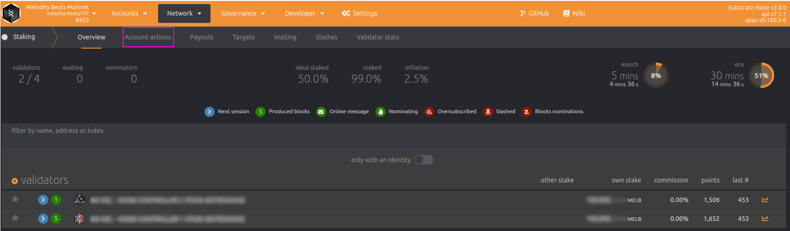

# Validators

## Who are validators?

Validators exist because of the consensus methodology (nPoS - nominated Proof of Stake)  used by the _Beats Chain_. A validator is a _node operator_ but in advance contributes to block production and validation.


Validators receive prizes for the service they give to the network but they will lose funds in case of unfair or malicious behaviour


## Setting up a validator node

There are two methods of setting up a validator node:

* getting the official sources and compiling them using Rust compiler
* getting the official executables and simply run them on your machine


Executables are built only for Linux machines, for any other OS you need to compile the sources from scratch using `cargo`.


All released versions of the _Melodity Beats Nodes_ can be found on the [official GitHub repository](https://github.com/Do-inc/melodity-beats-chain/releases).&#x20;

In order to run a node download the `melodity-beats-node` __ executable in your machine using your preferred method, in the next example, we will use _wget_.

```
wget https://github.com/Do-inc/melodity-beats-chain/releases/download/v2.1.0/melodity-beats-node
```


Make sure to always download the latest version (v 2.1.0 at the time of writing).



You will need to make the file executable using:\
`chmod +x melodity-beats-node`


Another file needed is the configuration file named `chain-conf.raw.json` __ it will be included in all the releases as it holds the runtime code. You may download it with _wget_ as follows.

```
wget https://github.com/Do-inc/melodity-beats-chain/releases/download/v2.1.0/chain-conf.raw.json
```


Make sure to always download the latest version (v 2.1.0 at the time of writing).


Once the files are downloaded running a node is as simple as running the next command

```
./melodity-beats-node \ 
--chain chain-conf.raw.json \
--base-path /home/<username>/beats-chain/<your node name> \
--bootnodes /ip4/<boot-node ip>/tcp/30333/p2p/<boot-node identifier> \
--validator \
--name <your node name> \
--rpc-cors all
```

This command will:

* Start the `melodity-beats-node` from your current directory
* Load the configuration stored in `chain-conf.raw.json`
* Set the storage path where all blocks and data will be stored to `/home/<username>/beats-chain/<your node name>`
* Load the current chain state from the node `/ip4/<boot-node ip>/tcp/30333/p2p/<boot-node identifier>`
* Start the node as a validator
* Set the node name to `<your node name>`&#x20;
* Permit all incoming RPC and Websocket connections to your node

This method of running a validator node starts it in live streaming, this is useful for testing but not for running and maintaining a node, in order to run and maintain a node we suggest you use a tool like `supervisor` that will keep your node up and running, and an example configuration for supervisor is given below

```
[program:beats_chain_node]
autorestart=true
autostart=true

command=/home/<username>/beats-chain/melodity-beats-node --chain chain-conf.raw.json --base-path /home/<username>/beats-chain/<your node name> --bootnodes /ip4/<boot-node ip>/tcp/30333/p2p/<boot-node identifier> --validator --name <your node name> --rpc-cors all
directory=/home/<username>/beats-chain/

user=<username>

stdout_logfile=/home/<username>/beats-chain/beats_chain_node.log
stdout_logfile_maxbytes=10MB
stdout_logfile_backups=1
stderr_logfile=/home/<username>/beats-chain/beats_chain_node.error.log
stderr_logfile_maxbytes=10MB
stderr_logfile_backups=1
```

Explaining a bit the supervisor configuration provided above:

* L 1: Supervisor identifies the beats chain node as `beats_chain_node` __ so every time you need to interact, restart etc. with your node you may refer to it using this name
* L 2-3: The node will automatically restart (by default at most 3 times in 60 seconds) if it dies for any reason, also once `supervisor` starts the node will automatically start
* L 5-6: In the example configuration we have placed all the node files under the `/home/<username>/beats-chain` __ so we `chdir` to that folder before starting the node and then run the command to start the node
* L 8: Supervisor usually boots up as _root_ with its default configuration, in order to follow the _least privilege pattern_ we change from _root_ to a different user
* L 10-15: As `supervisor` starts the node as a daemon service we need to log the standard output and the errors if any, the two files are `/home/<username>/beats-chain/beats_chain_node.log` for the standard output and `/home/<username>/beats-chain/beats_chain_node.error.log` for the errors, both the files will be at most 10MB large and have a backup so that at most 40MB of storage is taken by the node execution logs.


Substrate based chains output the default standard output to `stderr` so you'll find the standards log mixed up with errors in your `<file>.error.log`



All `<text>` tags **must** be substituted in order for the program and the configuration to work, they are simply placeholders


Once `supervisor` is set up the next step in order to complete the whole tutorial is setting up a web server in order for you to connect to your node using Websockets and RPC.

To start you need to install and configure `nginx`.

```
apt install nginx
cat > /etc/nginx/sites-available/beats_chain_rpc <<EOF  
server {
        server_name <domain>;
 
        root /var/www/html;
        index index.html;
 
        location / {
          try_files $uri $uri/ =404;
 
          proxy_buffering off;
          proxy_pass http://localhost:9944;
          proxy_set_header X-Real-IP $remote_addr;
          proxy_set_header Host $host;
          proxy_set_header X-Forwarded-For $proxy_add_x_forwarded_for;
 
          proxy_http_version 1.1;
          proxy_set_header Upgrade $http_upgrade;
          proxy_set_header Connection "upgrade";
        }
 
#        listen [::]:443 ssl ipv6only=on;
        listen 443 ssl;
        ssl_certificate <your domain ssl certificate>;
        ssl_certificate_key <your domain ssl private key>;
 
        ssl_session_cache shared:cache_nginx_SSL:1m;
        ssl_session_timeout 1440m;
 
        ssl_protocols TLSv1 TLSv1.1 TLSv1.2 TLSv1.3;
        ssl_prefer_server_ciphers on;
 
        ssl_ciphers "ECDHE-ECDSA-CHACHA20-POLY1305:ECDHE-RSA-CHACHA20-POLY1305:ECDHE-ECDSA-AES128-GCM-SHA256:ECDHE-RSA-AES128-GCM-SHA256:ECDHE-ECDSA-AES256-GCM-SHA384:ECDHE-RSA-AES256-GCM-SHA384:DHE-RSA-AES128-GCM-SHA256:DHE-RSA-AES256-GCM-SHA384:ECDHE-ECDSA-AES128-SHA256:ECDHE-RSA-AES128-SHA256:ECDHE-ECDSA-AES128-SHA:ECDHE-RSA-AES256-SHA384:ECDHE-RSA-AES128-SHA:ECDHE-ECDSA-AES256-SHA384:ECDHE-ECDSA-AES256-SHA:ECDHE-RSA-AES256-SHA:DHE-RSA-AES128-SHA256:DHE-RSA-AES128-SHA:DHE-RSA-AES256-SHA256:DHE-RSA-AES256-SHA:ECDHE-ECDSA-DES-CBC3-SHA:ECDHE-RSA-DES-CBC3-SHA:EDH-RSA-DES-CBC3-SHA:AES128-GCM-SHA256:AES256-GCM-SHA384:AES128-SHA256:AES256-SHA256:AES128-SHA:AES256-SHA:DES-CBC3-SHA:!DSS";
}
EOF
ln -s /etc/nginx/sites-available/beats_chain_rpc /etc/nginx/sites-enabled/
rm /etc/nginx/sites-enabled/default
```

The previous configuration needs you to have:

* A domain name you own
* An SSL certificate for your domain

Once the Nginx server endpoint is set up its time to set up Nginx to work as a daemon with `supervisor`.

```
cat > /etc/supervisor/conf.d/nginx.conf <<EOF
[program:nginx]
command=/usr/sbin/nginx -g "daemon off;"
autostart=true
autorestart=true
startretries=5
numprocs=1
stderr_logfile=/var/log/supervisor/%(program_name)s.log
stderr_logfile_maxbytes=10MB
stdout_logfile=/var/log/supervisor/%(program_name)s.error.log
stdout_logfile_maxbytes=10MB
EOF
systemctl disable nginx
service nginx stop
supervisorctl reread
supervisorctl update
supervisorctl status
```

The previous commands load the Nginx configuration to the standard Supervisor configuration and reload the supervisor configuration actually starting Nginx as a supervised daemon.

## Candidating as a validator

Even if the node is completely set up you're not yet candidating as a validator and your node is simply acting as a backup one.&#x20;

To candidate, your node as a validator first download `subkey`, a tool for generating substrate-based accounts. You can find the official version of `subkey` in our GitHub repository or use the following command to directly download it.

```
wget https://github.com/Do-inc/melodity-beats-chain/releases/download/v1.0.0/subkey
```

In order to candidate as a validator, you need two wallet accounts, namely the _controller_ and the _stash_ they differ in how they work as the _stash_ owns the funds but cannot actually use them, only the _controller_ has the permission to move and use the funds on the _stash_ wallet.

In order to generate the controller keys run:

```
./subkey generate -n beats -w 24
```

This will generate a 24 words seed phrase for your wallet and return you will all the data you need, an example output is the following


Do not use any of the following keys are their seed is publicly accessible and well known


```
Secret phrase `label escape polar lucky boil grid knee robot width country unit tourist easily beef rain shrimp identify tobacco tell width away curtain electric steel` is account:
  Secret seed:      0x98a87454c15175139be9c69deb509795f9f3f0ce95db0d59697ace33ddb88526
  Public key (hex): 0x96f358e35dcecad0bd74d372af0145f6803986b5fa64ec6b18d84291a4e46474
  Account ID:       0x96f358e35dcecad0bd74d372af0145f6803986b5fa64ec6b18d84291a4e46474
  SS58 Address:     6kHXCvS5UKcUYbH35TdkqX137bAXcZPKCB9v8BqhzLd8nct9
```

Store in a safe place the 24 words phrase and annotate your ss58 address as you will need it.\
Now your controller address is `6kHXCvS5UKcUYbH35TdkqX137bAXcZPKCB9v8BqhzLd8nct9` generating the stash account is a bit different, you may run:

```
./subkey inspect -n beats "<your 24 words seed>//stash"
```

This will generate a completely new account and return you with an output similar to the following example

```
Secret Key URI `label escape polar lucky boil grid knee robot width country unit tourist easily beef rain shrimp identify tobacco tell width away curtain electric steel//stash` is account:
  Secret seed:      0xe9c45551c350711758f2c669f3c4acb1db4aeae03908f3cb93770fadbab6da3a
  Public key (hex): 0x324ccb296cbd7f1df17b3938c0caf783db9dfcf95004c2372e0c46cf486f5723
  Account ID:       0x324ccb296cbd7f1df17b3938c0caf783db9dfcf95004c2372e0c46cf486f5723
  SS58 Address:     6i1YwYCaARv6Z6fSZdWFoJWhfMeWLMTSqsNCtwxWmpjhP36p
```

Now your stash address is `6i1YwYCaARv6Z6fSZdWFoJWhfMeWLMTSqsNCtwxWmpjhP36p` , store it somewere as we need it a moment.

#### Polkadot.js extension

In order to ease the procedure of setting up a validator node now that your node is up and running on a server, we start interacting with it using RPC but first, we need to set up the extension to work with the Polkadot environment.&#x20;

The extension you're going to install is the officially, community-supported extension, you can download and install it in your browser from [https://polkadot.js.org/extension/](https://polkadot.js.org/extension/)

Once the installation of the extension is completed activate it by clicking it and you'll be presented with a window similar to the following pic.


If you have previously used it you may have one or more accounts otherwise the popup will be empty. In order to add a new account click the _plus button_ on the top right of the popup and you'll be presented with a screen similar to the one below.

.png>)

Select "_Import account from pre-existing seed_" so that you can enter the previously generated seed using subkey and you'll be presented with the following screen.

.png>)

Proceed to insert the raw seed, leave the other options to their default values and click next, you'll be asked to enter a name for your account and a password to secure it, name it something like "_\<whatever you want> - Controller_" so that you can easily recognize it from the _stash_ account.

Once completed the import of the controller repeat the procedure in order to add the stash account, but once you're presented with the import screen open the advanced section and enter the value as in the following pic.


Proceed to insert the raw seed then click next, you'll be asked to enter a name for your account and a password to secure it, name it something like "_\<whatever you want> - Stash_" so that you can easily recognize it from the _controller_ account.

Now that the extension is set up we can proceed with the real candidacy.

#### Candidating your node to be a validator

All the operations from now on will be executed on the official Polkadot hosted app, [https://polkadot.js.org/apps/#/explorer](https://polkadot.js.org/apps/#/explorer)

Connect to one of the official nodes using the "_live networks_" section or insert in the "custom node" field under the "_development_" section one of the official provider links.

Navigate to the account section, and allow the polkadot.js extension to inject the accounts. Then check that your _stash_ wallet owns enough funds to start the stacking process, remember that the controller needs funds too in order to run actions on the stash account.

Once you're sure to own enough funds in the controller to stake and control the stash wallet open a new page of the explorer but instead of connecting to one of the officials granted nodes open the "custom" section and insert `wss://<your server ip>` then press switch on the top of the page.

.png>)

Once connected to your node open the _developer_ section and select `RPC calls` like in the following picture.

.png>)

Once opened the `RPC calls` section select the `author` __ endpoint and the `rotateKeys` function as in the following picture.

.png>)

Then click on the "_Submit RPC call_" button a full code will be returned on the page, copy it and annotate it.\
Connect back to one of the official nodes and navigate to the `stacking` section under `Network`.  Then navigate to the `Account actions` table like in the following pic.



Click the "Validator" button on the right of the page and a popup similar to the following will show up.


Select your controller account in the second field and your stash account in the first one. Insert the number of funds to stake in the "_Value Bonded_" field remember that the controller must own enough funds to pay for transaction fee and to execute any other action on the stash account usually better to leave at least a couple of thousand MELB in the controller for all the procedures and fees.

Based on the way you want to receive the funds choose one of the options from the last dropdown, if you want to receive a higher annual APY you may leave the default option checked.

Press "_Next_" once ready and you'll be presented with a screen similar to the following.

.png>)

Insert in the first field the result of the previous call to `rotateKeys` __ define a reward commission that fits your needs then click the "Bond & Validate" button and sign the transaction.

You've now successfully set up your validator node, at the next era rotation (about 1 hour) if a position is available and your node has enough nominators it will be elected and start contributing to the network.

## Validator payout

Validator payout may be released by anyone and will be triggered for all the validators, you can check the pending payout and the `Payout` table of the `Stake` section.

Payouts will be computed at the end of each era (about 1 hour).
